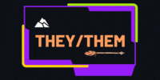

<h2 align="center">I'm Quentin, currently working at Welcome to the Jungle as a Backend Developer Apprentice.</h2>

<h1>Technologies I'm working on 💻:</h1>

<table align="center">
<tr align="center">
<td> Elixir</td>
<td> Phoenix</td>
<td> Python</td>
<td> Django</td>
<td> PostgreSQL</td>
<td> TypeScript</td>
<td> React</td>
<td> Docker</td>
<td> Kubernetes</td>
<td> AWS</td>          
</tr>
</table>          

<h1> Who Am I 🎭: </h1>

 I've got several experiences in the marketing and communication field, particularly in Social Media and Brand strategies.
I'm passionate about art and cultural stuff in general.

<h1>Some statistics 📊:</h1>

